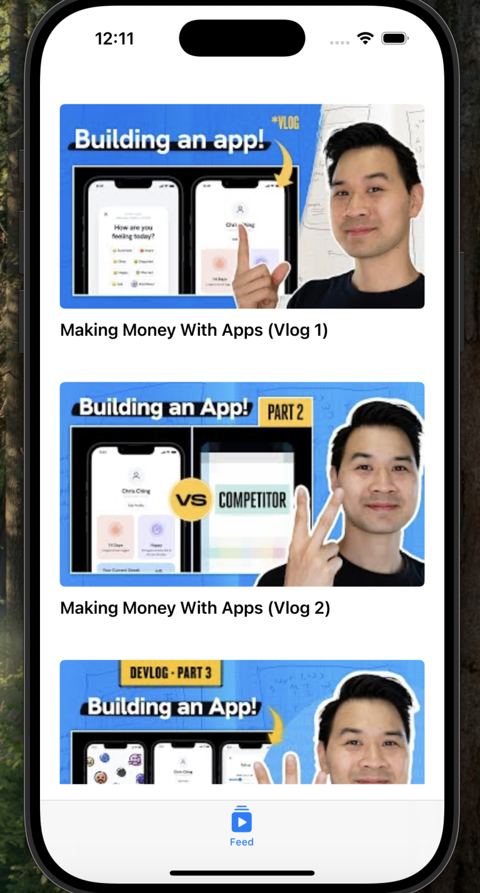
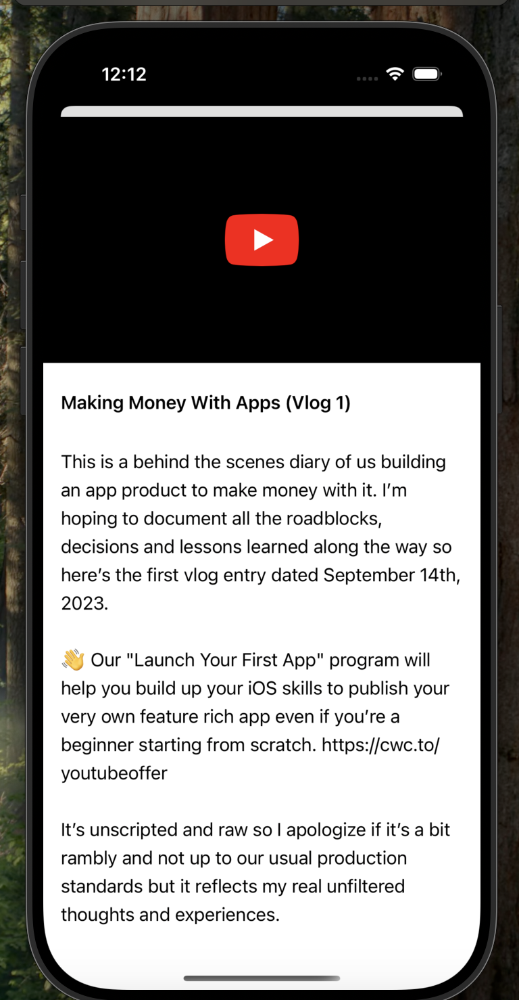
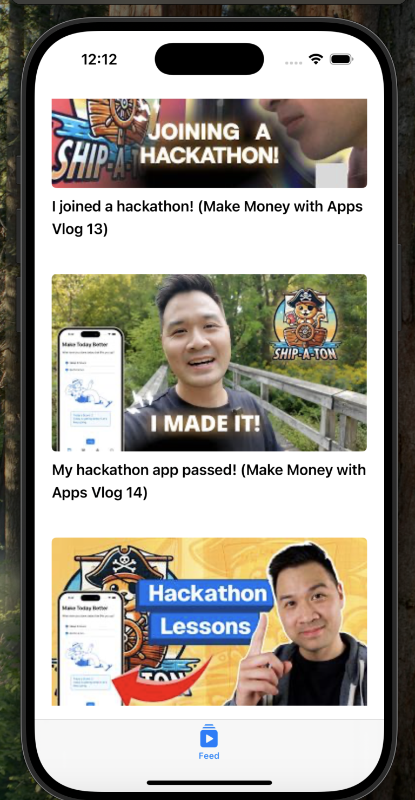

# YouTube Clone App

Welcome to the **YouTube Clone App**! This project is my first step into iOS app development using Swift. It’s a simple YouTube clone that fetches data from the official YouTube API and displays it in a user-friendly interface. I'm currently learning Swift and SwiftUI to enhance my skills and get comfortable with these tools.

## Project Overview

### Technology Stack
- **Swift:** The native language for iOS development.
- **SwiftUI and UIKit:** Used for building dynamic and responsive user interfaces.

### API Integration
- Fetching video data, metadata, and other information from the official YouTube API.

## Features

1. **Home Screen**  
   Displays a list of videos fetched from the YouTube API.

2. **Video Screen**  
   Simulates a video player interface.

3. **Scroll Feature**  
   Smooth scrolling through a list of videos.

## Screenshots
Screenshots for the app are stored in the following directory:
`/ytapiapp/ScreenShots?ref_type=heads`

### Available Screenshots
- **homeScreen.png**  
   Displays the main interface showcasing the video feed.
   

   
- **video.png**  
   Highlights the video-playing interface.
   

   
- **scroll.png**  
   Demonstrates the smooth scrolling feature.
   

## Why This Project?

By working on this app, I aim to:
- Understand the basics of iOS development.
- Learn how to integrate APIs into a mobile application.
- Explore UI design using SwiftUI and UIKit.

### Thank You for Checking Out My Project!
